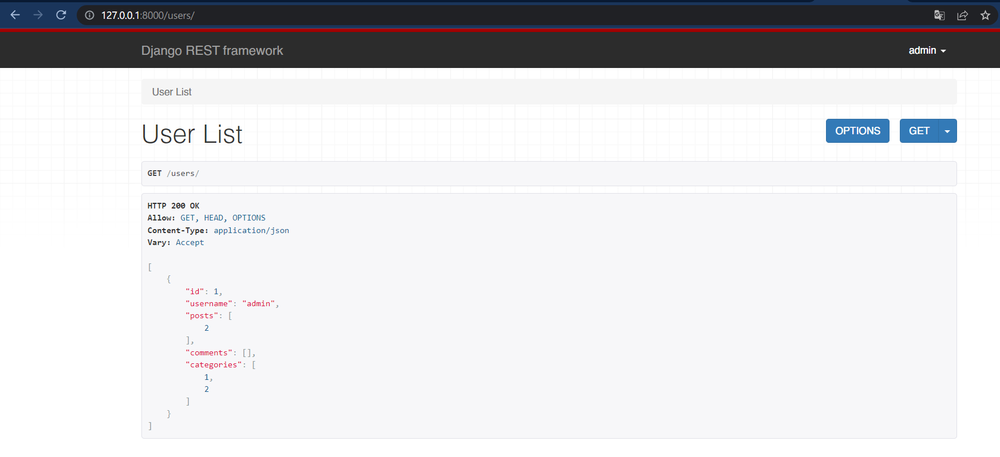

# Django-Rest-Framework-Blog-Api
Django Rest Framework Blog Api
## Local Setup

```
$ git clone https://github.com/smthqz/Django-Rest-Framework-Blog-Api.git
$ cd Django-Rest-Framework-Blog-Api
$ python manage.py runserver
```

## Screenshots



